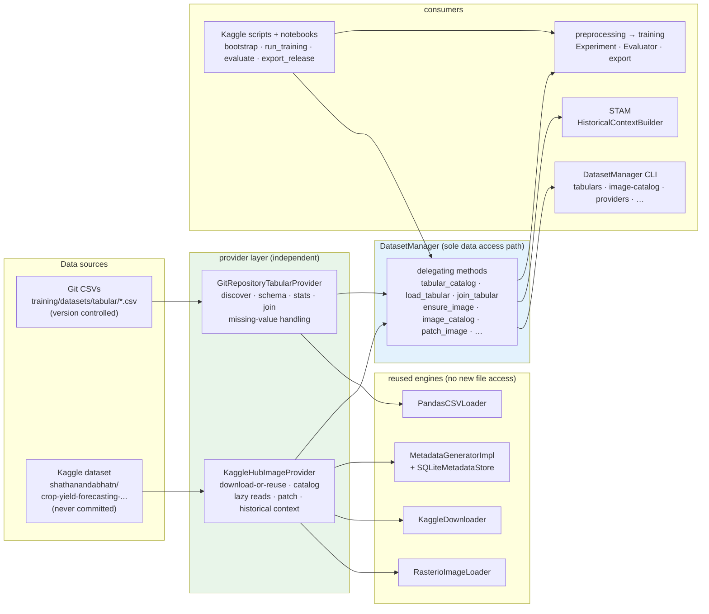
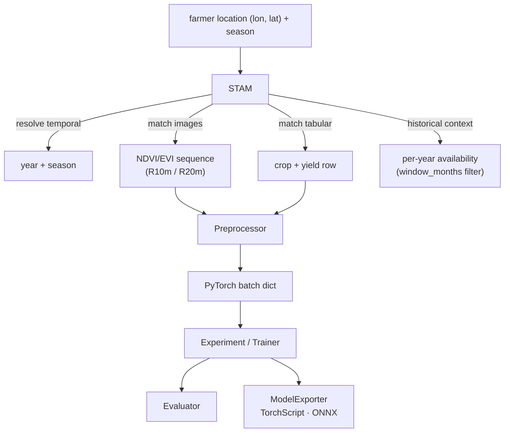

# R1.2 Provider Architecture

```mermaid
flowchart LR
    subgraph Sources["Data sources"]
        GIT["Git CSVs<br/>training/datasets/tabular/*.csv<br/>(version controlled)"]
        KAGGLE["Kaggle dataset<br/>shathanandabhatn/<br/>crop-yield-forecasting-...<br/>(never committed)"]
    end

    subgraph Providers["provider layer (independent)"]
        TP["GitRepositoryTabularProvider<br/>discover · schema · stats · join<br/>missing-value handling"]
        IP["KaggleHubImageProvider<br/>download-or-reuse · catalog<br/>lazy reads · patch · historical context"]
    end

    subgraph Engines["reused engines (no new file access)"]
        CL["PandasCSVLoader"]
        IL["RasterioImageLoader"]
        KD["KaggleDownloader"]
        MG["MetadataGeneratorImpl<br/>+ SQLiteMetadataStore"]
    end

    subgraph Manager["DatasetManager (sole data access path)"]
        DM["delegating methods<br/>tabular_catalog · load_tabular · join_tabular<br/>ensure_image · image_catalog · patch_image · …"]
    end

    subgraph Consumers["consumers"]
        CLI["DatasetManager CLI<br/>tabulars · image-catalog · providers · …"]
        STAM["STAM<br/>HistoricalContextBuilder"]
        PIPE["preprocessing → training<br/>Experiment · Evaluator · export"]
        KAG["Kaggle scripts + notebooks<br/>bootstrap · run_training · evaluate · export_release"]
    end

    GIT --> TP
    KAGGLE --> IP
    TP --> CL
    IP --> IL
    IP --> KD
    IP --> MG
    TP --> DM
    IP --> DM
    DM --> CLI
    DM --> STAM
    DM --> PIPE
    KAG --> DM
    KAG --> PIPE

    style Providers fill:#e8f5e9
    style Manager fill:#e3f2fd
```

## Data flow (one observation)

```mermaid
flowchart TB
    LOC["farmer location (lon, lat) + season"] --> S["STAM"]
    S -->|resolve temporal| T["year + season"]
    S -->|match images| R["NDVI/EVI sequence<br/>(R10m / R20m)"]
    S -->|match tabular| TAB["crop + yield row"]
    S -->|historical context| H["per-year availability<br/>(window_months filter)"]
    R --> P["Preprocessor"]
    TAB --> P
    P --> B["PyTorch batch dict"]
    B --> E["Experiment / Trainer"]
    E --> EV["Evaluator"]
    E --> X["ModelExporter<br/>TorchScript · ONNX"]
```
