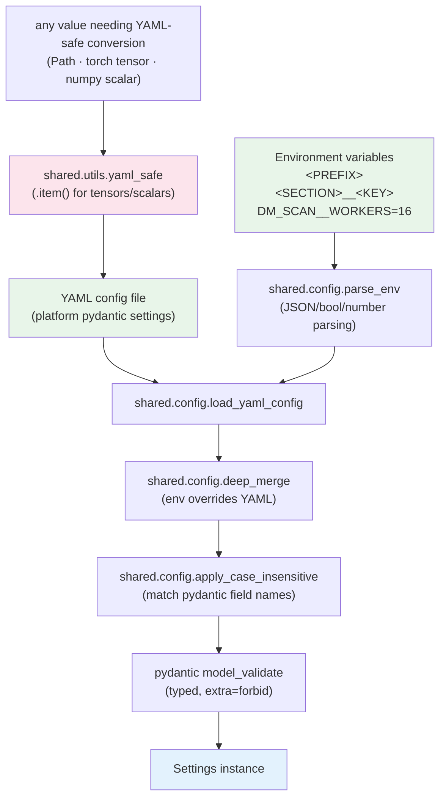

# R1.3 Configuration Resolution

Consumers:

| Consumer | Prefix | Loader |
| --- | --- | --- |
| `training/dataset_manager/config.py` | `DM_` | `load_settings()` |
| `training/training/config.py` | `TD_` | `load_training_config()` |
| `training/stam/config.py` | `ST_` | `load_stam_config()` |
| `training/preprocessing/config.py` | `PPT_` | `load_preprocessing_config()` |
| `training/explainability/config.py` | `EXP_` | `load_explainability_config()` |
| `application/backend/app/core/config.py` | `BACKEND_` | `Settings` bootstrap |

All six share `parse_env → deep_merge → apply_case_insensitive` from
`shared.config`; each adds only its own pydantic model. Before R1.3 the four
`_yaml_safe` copies and six private helper copies lived in these files.
