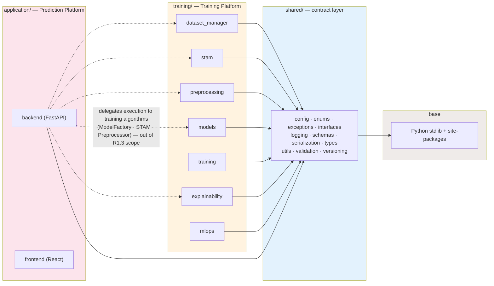

# R1.3 Dependency Rules

Rules that hold and are verified:

1. `training/*` imports only `shared` (plus stdlib/third-party).
2. `application/backend/app/core` imports `shared` for utilities; it never
   imports private `training` helpers.
3. `shared` imports nothing from either platform.
4. The dashed lines are **execution delegation** (the backend calls training
   algorithms at runtime), not utility imports — intentional and unchanged.
