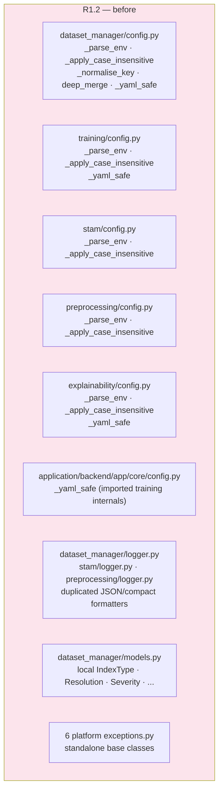
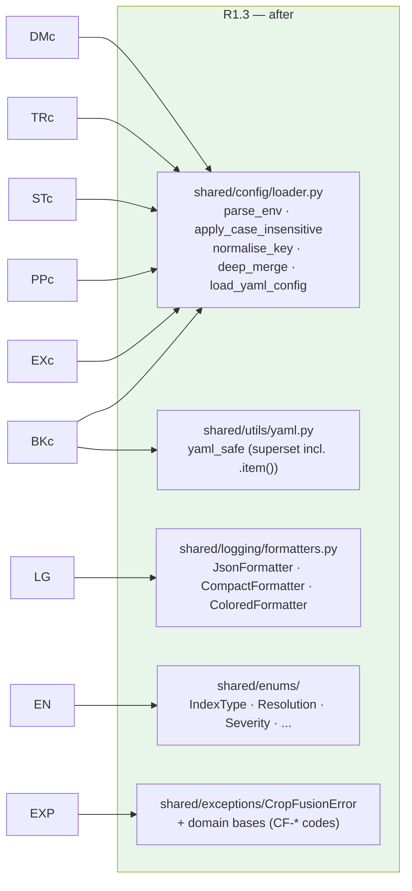

# R1.3 Migration Flow

Before (R1.2) — duplicated helpers across platforms:

After (R1.3) — one source of truth in `shared/`:

Steps taken:

1. Extracted the duplicated config primitives into `shared.config.loader` and
   `shared.utils.yaml_safe`; rewired all six consumers to import them.
2. Extracted the JSON/compact log formatters into `shared.logging.formatters`;
   the three platform loggers now import from `shared`.
3. Moved the canonical enums into `shared.enums`;
   `training/dataset_manager/models.py` re-exports them (no local definitions).
4. Re-based the six platform exception hierarchies onto
   `shared.exceptions.CropFusionError`, preserving each platform's `code`
   prefix and adding `suggested_resolution`.
5. Added shared **tests** (101) and verified every platform suite stays green.
