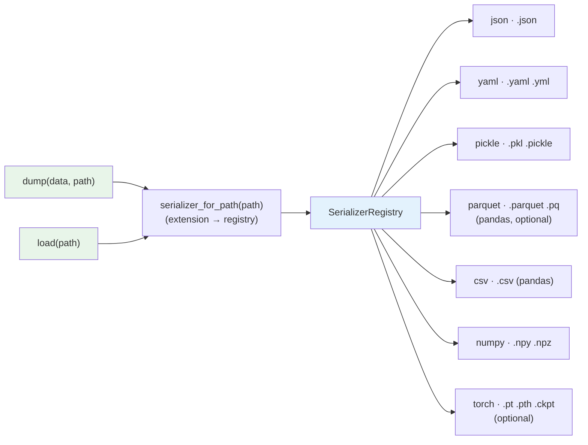
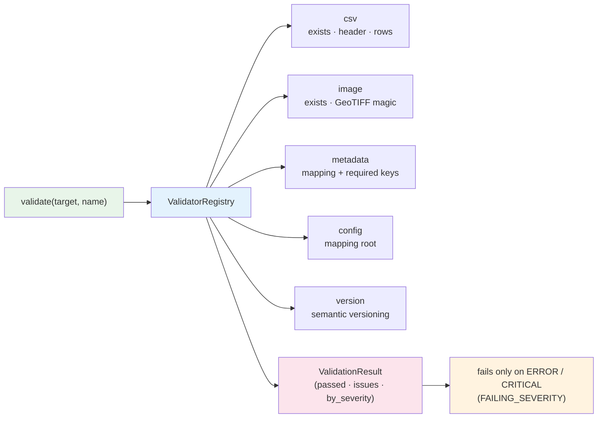

# R1.3 Serialization & Validation

## Serialization

```mermaid
flowchart LR
    D["dump(data, path)"] --> DISPATCH["serializer_for_path(path)<br/>(extension → registry)"]
    LOAD["load(path)"] --> DISPATCH
    DISPATCH --> REG["SerializerRegistry"]
    REG --> JSON["json · .json"]
    REG --> YAML["yaml · .yaml .yml"]
    REG --> PKL["pickle · .pkl .pickle"]
    REG --> PQ["parquet · .parquet .pq<br/>(pandas, optional)"]
    REG --> CSV["csv · .csv (pandas)"]
    REG --> NPY["numpy · .npy .npz"]
    REG --> TORCH["torch · .pt .pth .ckpt<br/>(optional)"]

    style D fill:#e8f5e9
    style LOAD fill:#e8f5e9
    style REG fill:#e3f2fd
```

## Validation

```mermaid
flowchart LR
    CALL["validate(target, name)"] --> REG2["ValidatorRegistry"]
    REG2 --> CSVV["csv<br/>exists · header · rows"]
    REG2 --> IMGV["image<br/>exists · GeoTIFF magic"]
    REG2 --> METAV["metadata<br/>mapping + required keys"]
    REG2 --> CONFV["config<br/>mapping root"]
    REG2 --> VERV["version<br/>semantic versioning"]
    REG2 --> RES["ValidationResult<br/>(passed · issues · by_severity)"]
    RES --> SEV["fails only on ERROR / CRITICAL<br/>(FAILING_SEVERITY)"]

    style CALL fill:#e8f5e9
    style REG2 fill:#e3f2fd
    style RES fill:#fce4ec
    style SEV fill:#fff3e0
```
