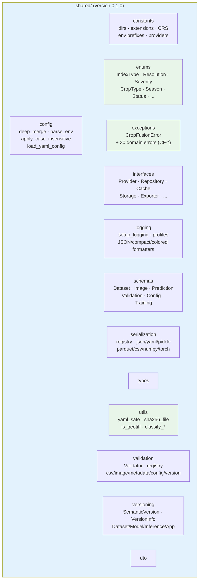

# R1.3 Shared Package Layout

- `utils`, `enums` and `exceptions` are the leaf-most packages; everything else
  in `shared/` builds on them.
- `config`, `serialization`, `validation`, `logging` and `versioning` import
  `enums`/`exceptions`/`utils` but never each other's private internals.
