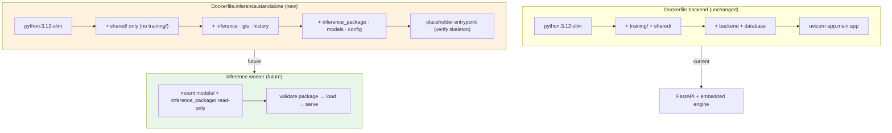

# R1.4 Deployment Flow

- `Dockerfile.inference.standalone` ships no training packages; the exported
  artifacts are mounted at run time.
- Build: `docker build -f application/docker/Dockerfile.inference.standalone -t cropfusion/inference-standalone .`
