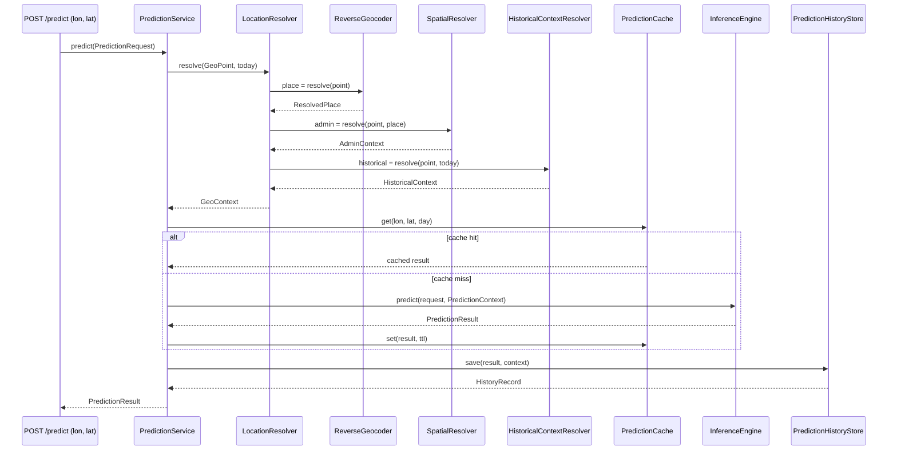

# R1.4 Inference Flow

```mermaid
sequenceDiagram
    participant API as POST /predict (lon, lat)
    participant SVC as PredictionService
    participant GIS as LocationResolver
    participant RG as ReverseGeocoder
    participant SR as SpatialResolver
    participant HC as HistoricalContextResolver
    participant CAC as PredictionCache
    participant ENG as InferenceEngine
    participant ST as PredictionHistoryStore

    API->>SVC: predict(PredictionRequest)
    SVC->>GIS: resolve(GeoPoint, today)
    GIS->>RG: place = resolve(point)
    RG-->>GIS: ResolvedPlace
    GIS->>SR: admin = resolve(point, place)
    SR-->>GIS: AdminContext
    GIS->>HC: historical = resolve(point, today)
    HC-->>GIS: HistoricalContext
    GIS-->>SVC: GeoContext
    SVC->>CAC: get(lon, lat, day)
    alt cache hit
        CAC-->>SVC: cached result
    else cache miss
        SVC->>ENG: predict(request, PredictionContext)
        ENG-->>SVC: PredictionResult
        SVC->>CAC: set(result, ttl)
    end
    SVC->>ST: save(result, context)
    ST-->>SVC: HistoryRecord
    SVC-->>API: PredictionResult
```

- Season / year are resolved by the GIS layer — the client never sends them.
- The engine is the only place a model forward happens (future phase).
