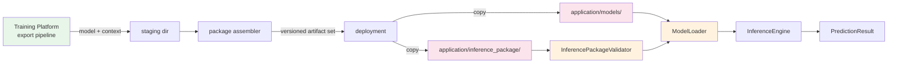

# R1.4 Inference Package Lifecycle

- `application/inference_package` is **consumed only** — it never generates
  artifacts (the `.gitignore` keeps shipped files out of git).
- The manifest (`manifest.py`) is the single source of truth for the file list.
