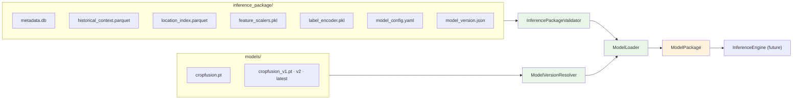

# R1.4 Model Loading Flow

1. Validate the package manifest (required artifacts + kinds).
2. Resolve the served version (`latest` default, or pinned `cropfusion_v*.pt`).
3. Load weights + scalers + encoder + config into a `ModelPackage`.
4. The future engine runs the package — no training code involved.

R1.4 ships the ports (`InferencePackageValidator`, `ModelVersionResolver`,
`ModelLoader`) — no loading is performed yet.
