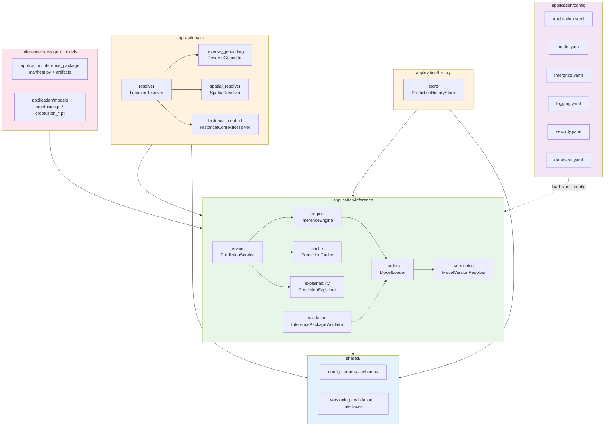

# R1.4 Prediction-Only Architecture

- `application/inference`, `application/gis`, `application/history` and the
  package/models contracts depend only on `shared/` (never `training/`).
- The existing `application/backend` (API + embedded engine) is unchanged and
  outside this diagram.
