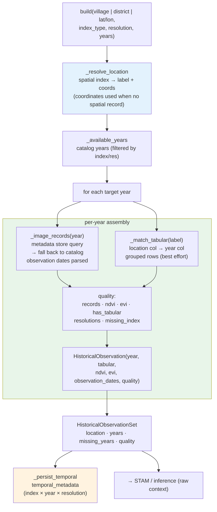

# R2.2 Historical Context

```mermaid
flowchart TB
    REQ["build(village | district | lat/lon,<br/>index_type, resolution, years)"]
    REQ --> RES["_resolve_location<br/>spatial index → label + coords<br/>(coordinates used when no spatial record)"]
    RES --> YEARS["_available_years<br/>catalog years (filtered by index/res)"]
    YEARS --> LOOP["for each target year"]

    subgraph PerYear["per-year assembly"]
        IMG["_image_records(year)<br/>metadata store query<br/>→ fall back to catalog<br/>observation dates parsed"]
        TAB["_match_tabular(label)<br/>location col → year col<br/>grouped rows (best effort)"]
        QUAL["quality:<br/>records · ndvi · evi · has_tabular<br/>resolutions · missing_index"]
        OBS["HistoricalObservation(year, tabular,<br/>ndvi, evi, observation_dates, quality)"]
    end

    LOOP --> IMG
    LOOP --> TAB
    IMG --> QUAL
    TAB --> QUAL
    QUAL --> OBS

    OBS --> SUM["HistoricalObservationSet<br/>location · years · missing_years · quality"]
    SUM --> PERSIST["_persist_temporal<br/>temporal_metadata<br/>(index × year × resolution)"]
    SUM --> OUT["→ STAM / inference (raw context)"]

    style RES fill:#e3f2fd
    style PerYear fill:#e8f5e9
    style PERSIST fill:#fff3e0
```
