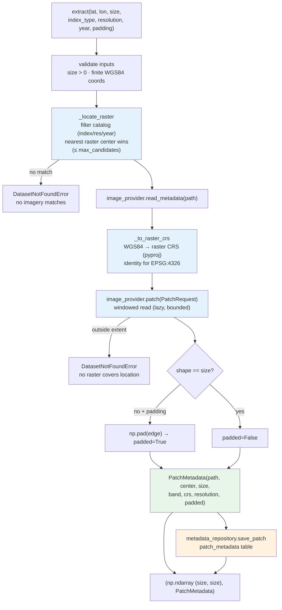

# R2.2 Patch Extraction

```mermaid
flowchart TB
    REQ["extract(lat, lon, size,<br/>index_type, resolution, year, padding)"] --> V["validate inputs<br/>size > 0 · finite WGS84 coords"]
    V --> LOC["_locate_raster<br/>filter catalog (index/res/year)<br/>nearest raster center wins<br/>(≤ max_candidates)"]
    LOC -->|no match| E1["DatasetNotFoundError<br/>no imagery matches"]
    LOC --> META["image_provider.read_metadata(path)"]
    META --> CRS["_to_raster_crs<br/>WGS84 → raster CRS (pyproj)<br/>identity for EPSG:4326"]
    CRS --> PATCH["image_provider.patch(PatchRequest)<br/>windowed read (lazy, bounded)"]
    PATCH -->|outside extent| E2["DatasetNotFoundError<br/>no raster covers location"]
    PATCH --> PAD{"shape == size?"}
    PAD -->|no + padding| PADP["np.pad(edge) → padded=True"]
    PAD -->|yes| NOPAD["padded=False"]
    PADP --> PM["PatchMetadata(path, center, size,<br/>band, crs, resolution, padded)"]
    NOPAD --> PM
    PM --> PERSIST["metadata_repository.save_patch<br/>patch_metadata table"]
    PM --> OUT["(np.ndarray (size, size), PatchMetadata)"]
    PERSIST --> OUT

    style LOC fill:#e3f2fd
    style CRS fill:#e3f2fd
    style PATCH fill:#e3f2fd
    style PERSIST fill:#fff3e0
    style PM fill:#e8f5e9
```
