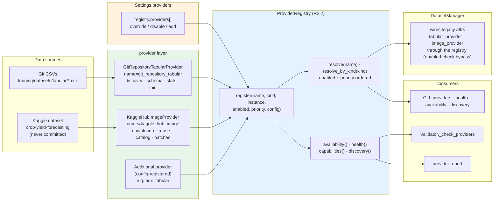

# R2.2 Provider Registry

```mermaid
flowchart LR
    subgraph Sources["Data sources"]
        GIT["Git CSVs<br/>training/datasets/tabular/*.csv"]
        KAGGLE["Kaggle dataset<br/>crop-yield-forecasting<br/>(never committed)"]
    end

    subgraph Providers["provider layer"]
        TP["GitRepositoryTabularProvider<br/>name=git_repository_tabular<br/>discover · schema · stats · join"]
        IP["KaggleHubImageProvider<br/>name=kaggle_hub_image<br/>download-or-reuse · catalog · patches"]
        AUX["Additional provider<br/>(config-registered)<br/>e.g. aux_tabular"]
    end

    subgraph Registry["ProviderRegistry (R2.2)"]
        REG["register(name, kind, instance,<br/>enabled, priority, config)"]
        RES["resolve(name) · resolve_by_kind(kind)<br/>enabled + priority ordered"]
        INTRO["availability() · health()<br/>capabilities() · discovery()"]
    end

    subgraph Config["Settings.providers"]
        CFG["registry.providers[]<br/>override / disable / add"]
    end

    subgraph Manager["DatasetManager"]
        MGR["wires legacy attrs<br/>tabular_provider · image_provider<br/>through the registry (enabled-check bypass)"]
    end

    subgraph Consumers["consumers"]
        CLI["CLI: providers · health · availability · discovery"]
        VAL["Validator._check_providers"]
        REP["provider report"]
    end

    GIT --> TP
    KAGGLE --> IP
    CFG --> REG
    TP --> REG
    IP --> REG
    AUX --> REG
    REG --> RES
    REG --> INTRO
    RES --> MGR
    RES --> CLI
    INTRO --> VAL
    INTRO --> REP

    style Providers fill:#e8f5e9
    style Registry fill:#e3f2fd
    style Config fill:#fff3e0
```
