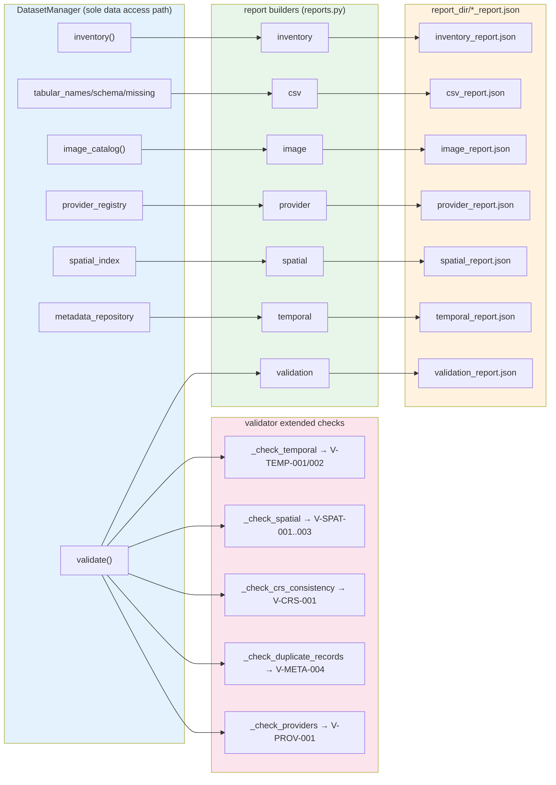

# R2.2 Reports & Extended Validation

```mermaid
flowchart LR
    subgraph Manager["DatasetManager (sole data access path)"]
        INVT["inventory()"]
        TAB["tabular_names/schema/missing"]
        IMG["image_catalog()"]
        REG["provider_registry"]
        SIDX["spatial_index"]
        MREP["metadata_repository"]
        VAL["validate()"]
    end

    subgraph Reports["report builders (reports.py)"]
        B1["inventory"]
        B2["csv"]
        B3["image"]
        B4["provider"]
        B5["spatial"]
        B6["temporal"]
        B7["validation"]
    end

    subgraph Out["report_dir/*_report.json"]
        F1["inventory_report.json"]
        F2["csv_report.json"]
        F3["image_report.json"]
        F4["provider_report.json"]
        F5["spatial_report.json"]
        F6["temporal_report.json"]
        F7["validation_report.json"]
    end

    subgraph Checks["validator extended checks"]
        C1["_check_temporal → V-TEMP-001/002"]
        C2["_check_spatial → V-SPAT-001..003"]
        C3["_check_crs_consistency → V-CRS-001"]
        C4["_check_duplicate_records → V-META-004"]
        C5["_check_providers → V-PROV-001"]
    end

    INVT --> B1
    TAB --> B2
    IMG --> B3
    REG --> B4
    SIDX --> B5
    MREP --> B6
    VAL --> B7
    B1 --> F1
    B2 --> F2
    B3 --> F3
    B4 --> F4
    B5 --> F5
    B6 --> F6
    B7 --> F7
    VAL --> C1
    VAL --> C2
    VAL --> C3
    VAL --> C4
    VAL --> C5

    style Manager fill:#e3f2fd
    style Reports fill:#e8f5e9
    style Out fill:#fff3e0
    style Checks fill:#fce4ec
```
