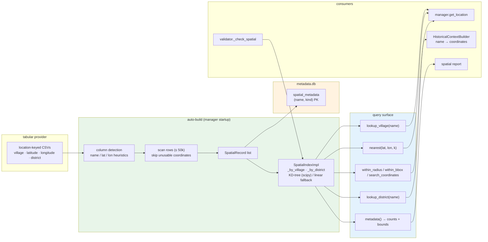

# R2.2 Spatial Index

```mermaid
flowchart LR
    subgraph Tabular["tabular provider"]
        DATASETS["location-keyed CSVs<br/>village · latitude · longitude · district"]
    end

    subgraph Build["auto-build (manager startup)"]
        HEUR["column detection<br/>name / lat / lon heuristics"]
        SCAN["scan rows (≤ 50k)<br/>skip unusable coordinates"]
        REC["SpatialRecord list"]
        IDX["SpatialIndexImpl<br/>_by_village · _by_district<br/>KD-tree (scipy) / linear fallback"]
    end

    subgraph Persist["metadata.db"]
        SPAT["spatial_metadata<br/>(name, kind) PK"]
    end

    subgraph Queries["query surface"]
        LV["lookup_village(name)"]
        LD["lookup_district(name)"]
        NN["nearest(lat, lon, k)"]
        RC["within_radius / within_bbox / search_coordinates"]
        META["metadata() → counts + bounds"]
    end

    subgraph Consumers["consumers"]
        LOC["manager.get_location"]
        HCB["HistoricalContextBuilder<br/>name → coordinates"]
        VAL["validator._check_spatial"]
        REP["spatial report"]
    end

    DATASETS --> HEUR --> SCAN --> REC --> IDX
    REC --> SPAT
    IDX --> LV
    IDX --> LD
    IDX --> NN
    IDX --> RC
    IDX --> META
    LV --> LOC
    LD --> HCB
    NN --> LOC
    RC --> LOC
    META --> REP
    VAL --> IDX

    style Build fill:#e8f5e9
    style Persist fill:#fff3e0
    style Queries fill:#e3f2fd
```
