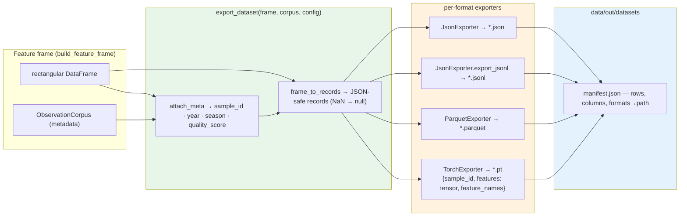

# R2.3 Dataset Export

```mermaid
flowchart LR
    subgraph In["Feature frame (build_feature_frame)"]
        FRAME["rectangular DataFrame"]
        CORPUS["ObservationCorpus (metadata)"]
    end

    subgraph Norm["export_dataset(frame, corpus, config)"]
        META["attach_meta → sample_id · year · season · quality_score"]
        REC["frame_to_records → JSON-safe records (NaN → null)"]
    end

    subgraph Formats["per-format exporters"]
        JSON["JsonExporter → *.json"]
        JSONL["JsonExporter.export_jsonl → *.jsonl"]
        PARQ["ParquetExporter → *.parquet"]
        PT["TorchExporter → *.pt<br/>{sample_id, features: tensor, feature_names}"]
    end

    subgraph Out["data/out/datasets"]
        MANIFEST["manifest.json — rows, columns, formats→path"]
    end

    FRAME --> META
    CORPUS --> META
    FRAME --> REC
    REC --> JSON
    REC --> JSONL
    REC --> PARQ
    REC --> PT
    META --> REC
    JSON --> MANIFEST
    JSONL --> MANIFEST
    PARQ --> MANIFEST
    PT --> MANIFEST

    style Norm fill:#e8f5e9
    style Formats fill:#fff3e0
    style Out fill:#e3f2fd
```
