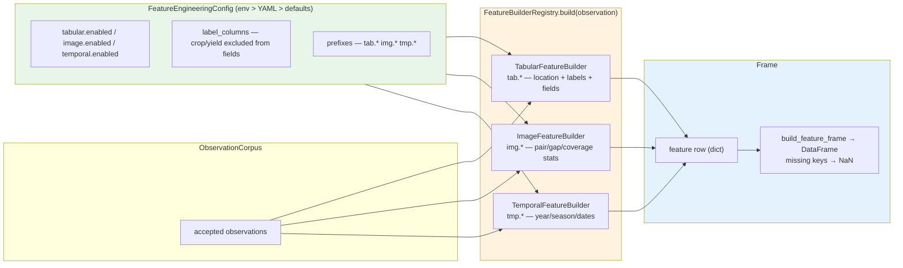

# R2.3 Feature Building

```mermaid
flowchart LR
    subgraph In["ObservationCorpus"]
        ACC["accepted observations"]
    end

    subgraph Build["FeatureBuilderRegistry.build(observation)"]
        TAB["TabularFeatureBuilder<br/>tab.* — location + labels + fields"]
        IMG["ImageFeatureBuilder<br/>img.* — pair/gap/coverage stats"]
        TMP["TemporalFeatureBuilder<br/>tmp.* — year/season/dates"]
    end

    subgraph CFG["FeatureEngineeringConfig (env > YAML > defaults)"]
        ENAB["tabular.enabled / image.enabled / temporal.enabled"]
        LBL["label_columns — crop/yield excluded from fields"]
        PX["prefixes — tab.* img.* tmp.*"]
    end

    subgraph Out["Frame"]
        ROW["feature row (dict)"]
        FRAME["build_feature_frame → DataFrame<br/>missing keys → NaN"]
    end

    ACC --> TAB
    ACC --> IMG
    ACC --> TMP
    CFG --> TAB
    CFG --> IMG
    CFG --> TMP
    TAB --> ROW
    IMG --> ROW
    TMP --> ROW
    ROW --> FRAME

    style CFG fill:#e8f5e9
    style Build fill:#fff3e0
    style Out fill:#e3f2fd
```
