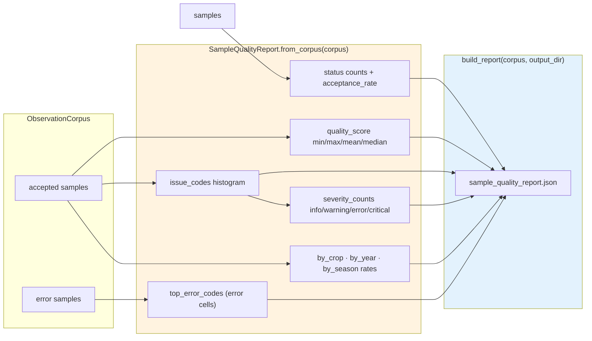

# R2.3 Quality-Control Reports

```mermaid
flowchart LR
    subgraph In["ObservationCorpus"]
        ACC["accepted samples"]
        ERR["error samples"]
    end

    subgraph QC["SampleQualityReport.from_corpus(corpus)"]
        STATUS["status counts + acceptance_rate"]
        QSUM["quality_score min/max/mean/median"]
        ISSUES["issue_codes histogram"]
        SEV["severity_counts info/warning/error/critical"]
        BYK["by_crop · by_year · by_season rates"]
        TOPERR["top_error_codes (error cells)"]
    end

    ACC --> QSUM
    ACC --> ISSUES
    ISSUES --> SEV
    ACC --> BYK
    ERR --> TOPERR
    SAMPLES["samples"] --> STATUS

    subgraph Out["build_report(corpus, output_dir)"]
        JSON["sample_quality_report.json"]
    end

    STATUS --> JSON
    QSUM --> JSON
    ISSUES --> JSON
    SEV --> JSON
    BYK --> JSON
    TOPERR --> JSON

    style QC fill:#fff3e0
    style Out fill:#e3f2fd
```
