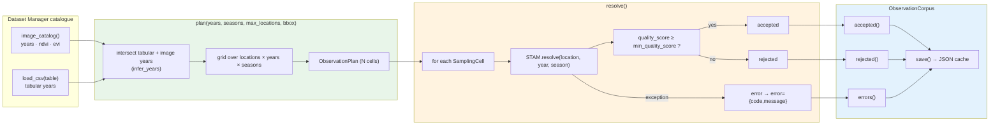

# R2.3 Sample Generation (Observation Resolver)

```mermaid
flowchart LR
    subgraph DM["Dataset Manager catalogue"]
        CAT["image_catalog()<br/>years · ndvi · evi"]
        TAB["load_csv(table)<br/>tabular years"]
    end

    subgraph Plan["plan(years, seasons, max_locations, bbox)"]
        INFER["intersect tabular + image years<br/>(infer_years)"]
        GRID["grid over locations × years × seasons"]
        PLAN["ObservationPlan (N cells)"]
    end

    subgraph Resolve["resolve()"]
        CELL["for each SamplingCell"]
        STAM["STAM.resolve(location, year, season)"]
        VERDICT["quality_score ≥ min_quality_score ?"]
        OK["accepted"]
        NO["rejected"]
        ERR["error → error={code,message}"]
    end

    subgraph Out["ObservationCorpus"]
        ACC["accepted()"]
        REJ["rejected()"]
        ERS["errors()"]
        SAVE["save() → JSON cache"]
    end

    CAT --> INFER
    TAB --> INFER
    INFER --> GRID --> PLAN
    PLAN --> CELL --> STAM --> VERDICT
    VERDICT -- yes --> OK
    VERDICT -- no --> NO
    STAM -- exception --> ERR
    OK --> ACC
    NO --> REJ
    ERR --> ERS
    ACC --> SAVE
    REJ --> SAVE
    ERS --> SAVE

    style Plan fill:#e8f5e9
    style Resolve fill:#fff3e0
    style Out fill:#e3f2fd
```
