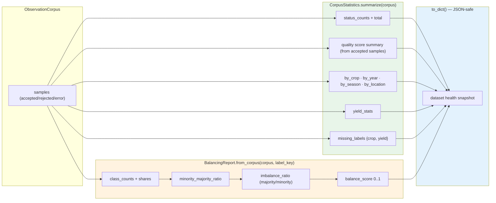

# R2.3 Statistics & Balancing

```mermaid
flowchart LR
    subgraph In["ObservationCorpus"]
        SAMPLES["samples (accepted/rejected/error)"]
    end

    subgraph Stats["CorpusStatistics.summarize(corpus)"]
        STATUS["status_counts + total"]
        Q["quality score summary (from accepted samples)"]
        GROUPS["by_crop · by_year · by_season · by_location"]
        YIELD["yield_stats"]
        MISSING["missing_labels {crop, yield}"]
    end

    subgraph Bal["BalancingReport.from_corpus(corpus, label_key)"]
        CC["class_counts + shares"]
        RATIO["minority_majority_ratio"]
        IR["imbalance_ratio (majority/minority)"]
        SCORE["balance_score 0..1"]
    end

    subgraph Out["to_dict() — JSON-safe"]
        REPORT["dataset health snapshot"]
    end

    SAMPLES --> STATUS
    SAMPLES --> Q
    SAMPLES --> GROUPS
    SAMPLES --> YIELD
    SAMPLES --> MISSING
    SAMPLES --> CC
    CC --> RATIO --> IR --> SCORE
    STATUS --> REPORT
    Q --> REPORT
    GROUPS --> REPORT
    YIELD --> REPORT
    MISSING --> REPORT
    SCORE --> REPORT

    style Stats fill:#e8f5e9
    style Bal fill:#fff3e0
    style Out fill:#e3f2fd
```
