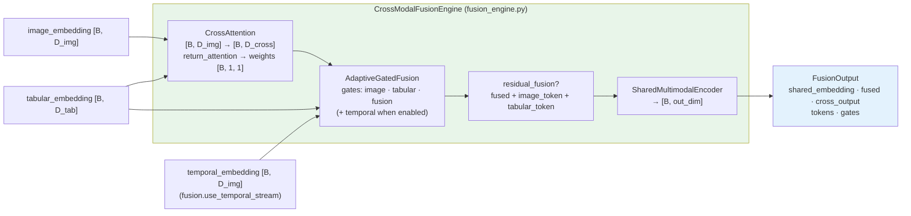

# R2.4 Cross-Modal Fusion Engine

Config-driven ablations (all in `ModelConfig`):

| ablation | switch |
| --- | --- |
| no cross-attention | `cross_attention.enabled: false` (cross path = image identity) |
| no gated fusion | `gated_fusion.enabled: false` (concat into shared encoder) |
| no residual fusion | `fusion.residual_fusion: false` |
| fourth temporal stream | `fusion.use_temporal_stream: true` |
