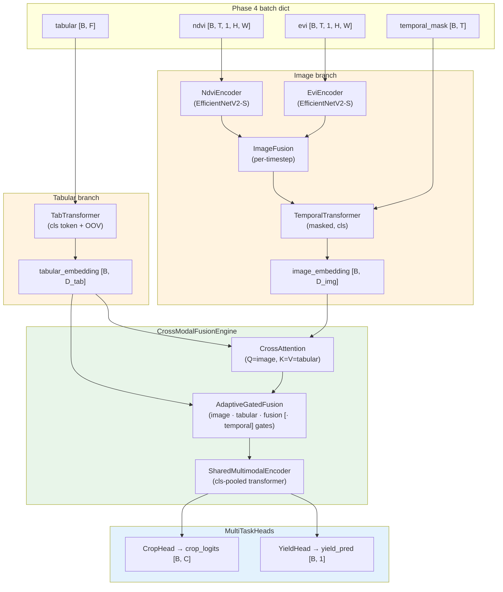

# R2.4 CropFusion Model Architecture

Single-modality models bypass the engine: `tabular → SharedMultimodalEncoder`
or `image → SharedMultimodalEncoder` (the `shared_encoder` property hides which
path is active).
