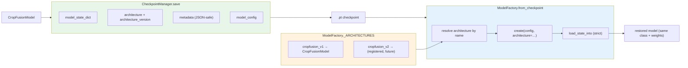

# R2.4 Architecture Registry & Checkpoint Rebuild

Guarantees:

- checkpoints record the architecture name + schema version, so a registered
  future architecture is rebuilt with its own class, not the built-in one;
- `metadata` is JSON-serialised on save so `torch.load(weights_only=True)`
  accepts it (`torch.__version__` is otherwise rejected by the safe loader);
- unknown explicit architectures raise `MDL-CONFIG-001`; unregistered config
  display names fall back to `CropFusionModel`.
