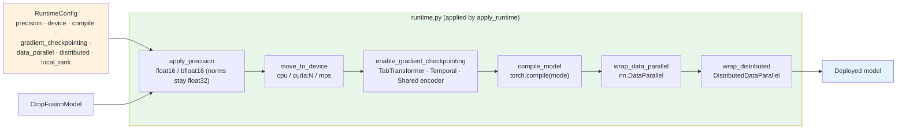

# R2.4 Model Runtime



Entry points:

```python
model.to_precision("bfloat16")            # model method
amp_context("bfloat16", "cpu")            # autocast block
model.enable_gradient_checkpointing(True)
model.compile(mode="default", backend="eager")
ModelFactory.apply_runtime(model)         # everything in fixed order
ModelFactory.create_with_runtime(cfg)     # build + configure
```
