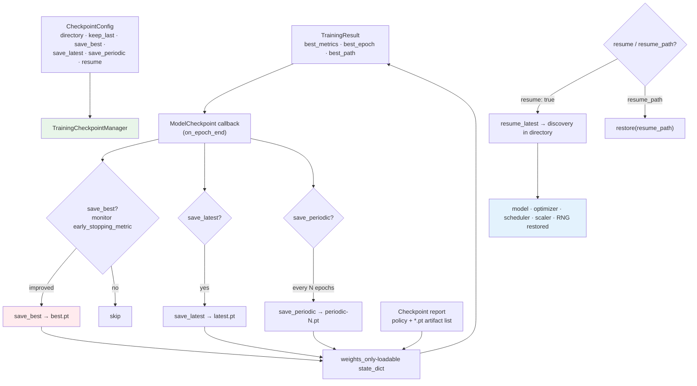

# R4 Checkpoint Flow

The `best_path` reported in `TrainingResult` / `training_report.md` comes from
the checkpoint manager. The checkpoint report lists the actual `*.pt` files in
the checkpoint directory.
