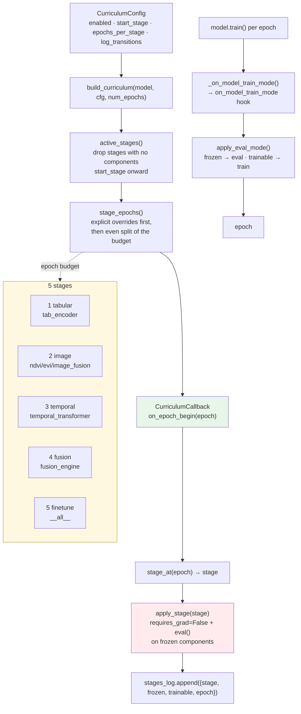

# R4 Curriculum Flow



Semantics:

```python
config = TrainingConfig(curriculum={"enabled": True, "start_stage": 3})
# -> active stages: temporal → fusion → finetune (resume-from-any-stage)
```

`all_ranks=True` on the callback keeps the parameter graph identical across
DDP processes.
