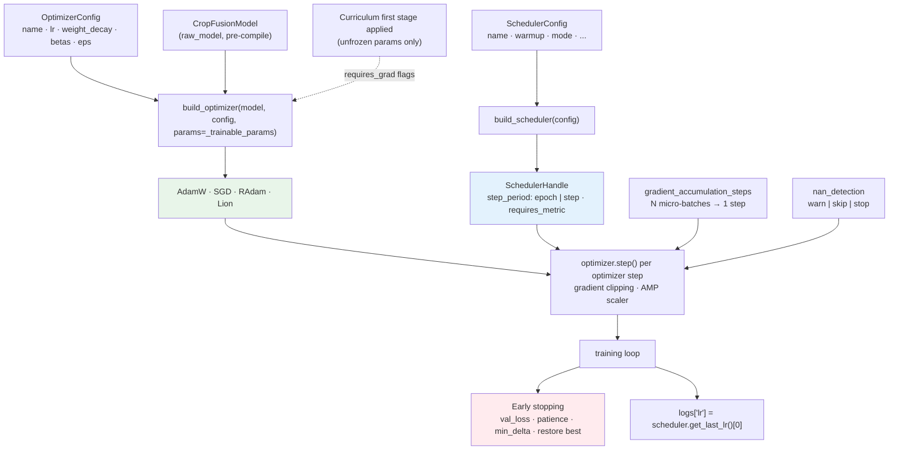

# R4 Optimizer Flow

Notes:

* The optimizer is built **after** the curriculum applies its first stage, so
  only trainable parameters get optimizer slots.
* `lr` is logged per step / epoch from the `SchedulerHandle` for the reports.
* Schedulers that need a metric (`ReduceLROnPlateau`) are stepped with the
  monitored validation value after each epoch.
