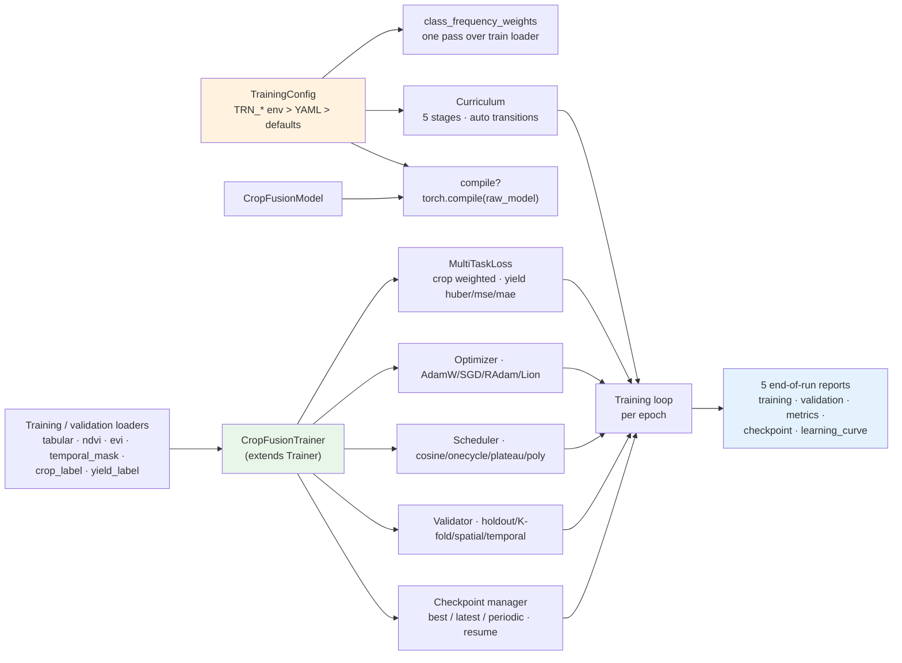

# R4 Training Pipeline



Entry points:

```python
trainer = CropFusionTrainer(model, train_loader, config, val_loader=val_loader)
result = trainer.train()   # -> CropFusionTrainingResult (stages, reports)
```
