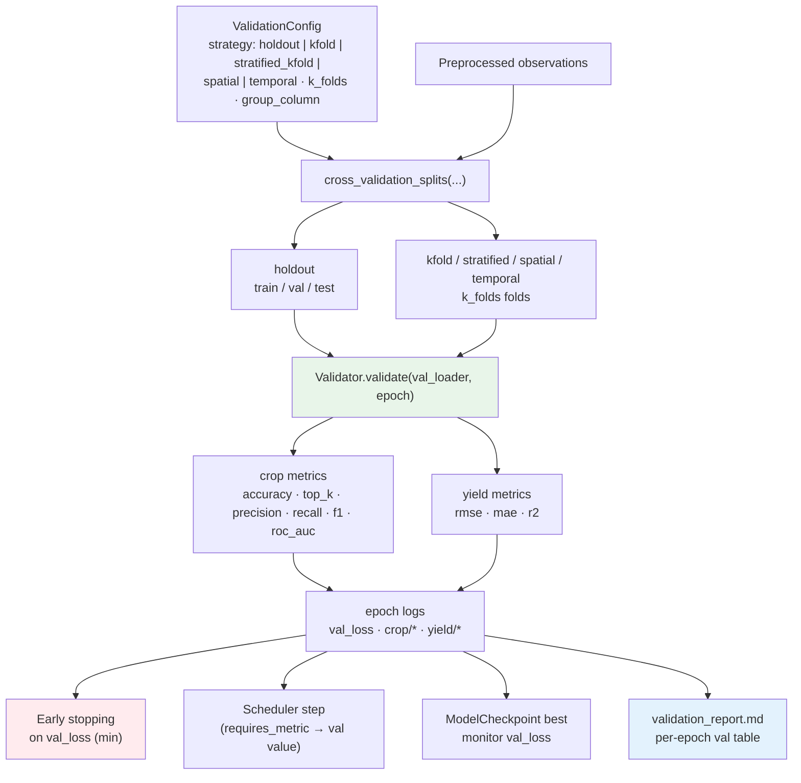

# R4 Validation Flow

Validation runs every `general.validation_frequency` epochs; without a
`val_loader` the trainer skips validation, early stopping and best-checkpoint
tracking gracefully (the validation report then notes that no validation
metrics were recorded).
