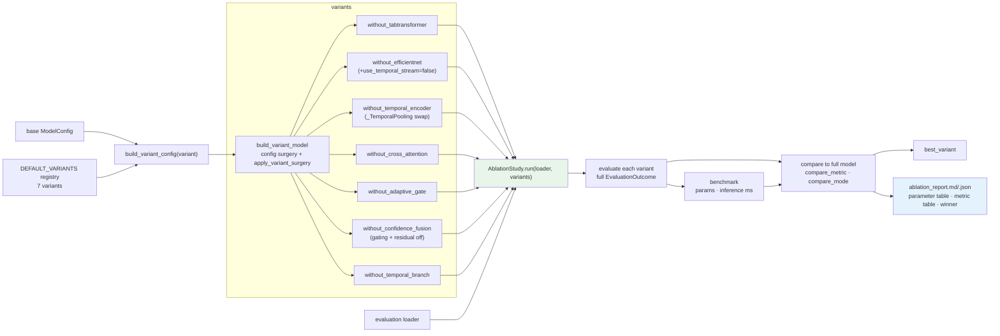

# R5 Ablation Study

`variants=None` sweeps all seven; a subset can be passed explicitly. Both
`build_variant_config` and `apply_variant_surgery` are public so a single
variant can be built and inspected without running the sweep.
