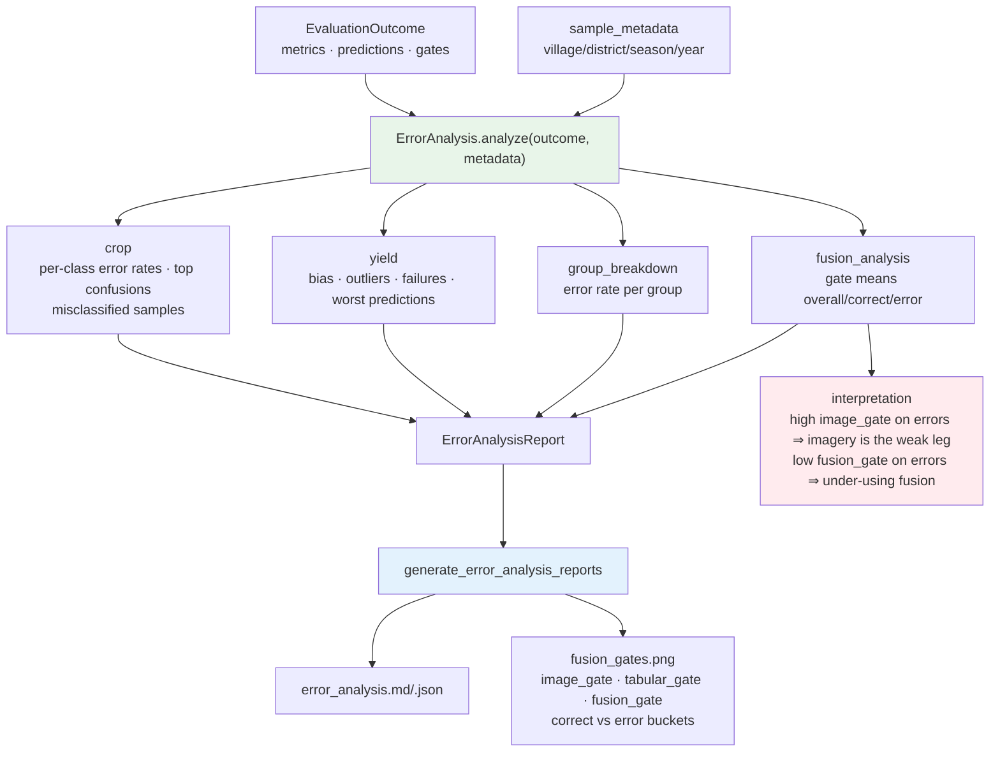

# R5 Error Analysis

`sample_metadata` must have exactly one entry per evaluated sample or
`ErrorAnalysisError` is raised. The fusion-gate figure is emitted whenever the
evaluator collected per-sample gates.
