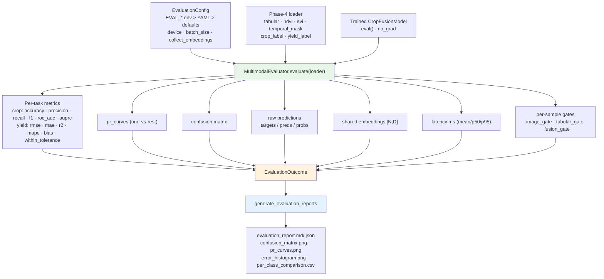

# R5 Evaluation Flow

A single forward pass per batch produces the predictions, embeddings and gates
together; nothing is re-read from disk. The outcome feeds the comparison,
ablation and error-analysis stages.
