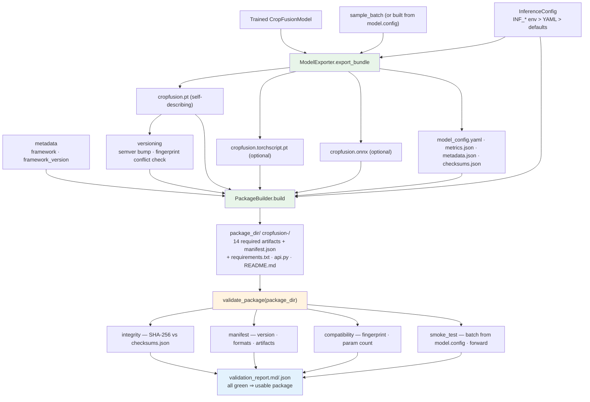

# R5 Inference Package Flow

`manifest.json` lists artifact checksums plus the formats; both
`checksums.json` and `manifest.json` exclude themselves from the checksum map.
The `pytorch` format is always required; `torchscript` / `onnx` are optional
per `exporter.formats`.
