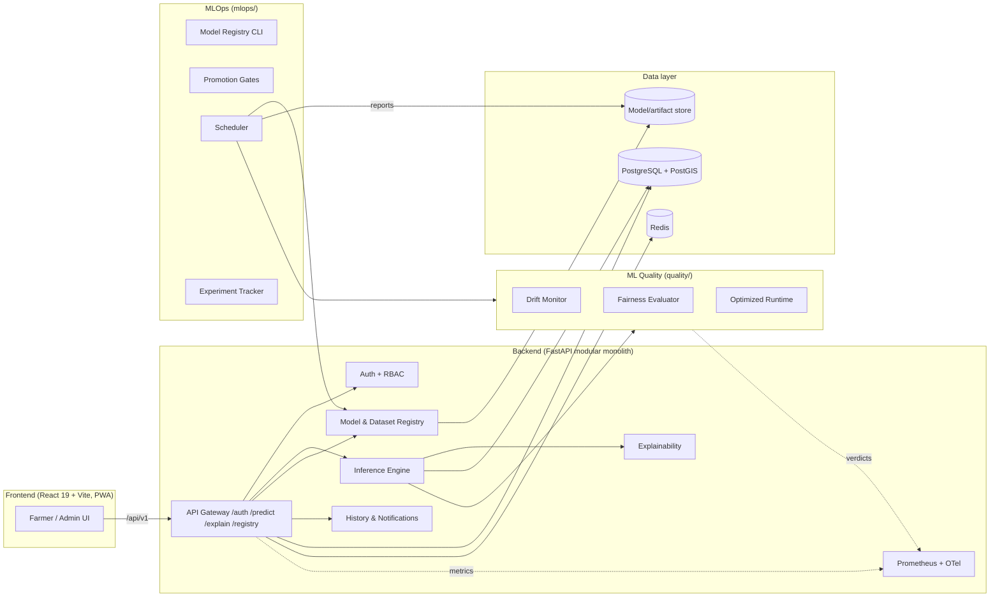
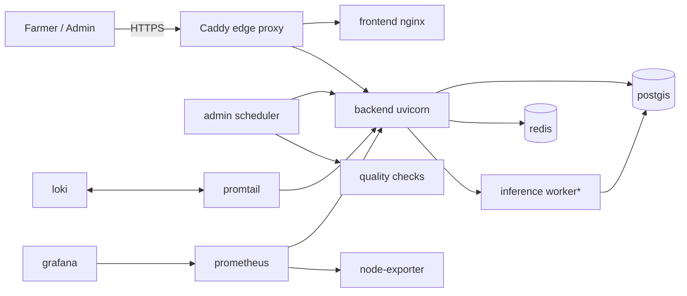

# CropFusion System Architecture

CropFusion is a precision-agriculture decision support platform. It ingests
tabular agronomic data plus satellite-derived vegetation indices, produces
crop-recommendation and yield-prediction outputs, and explains them to
non-expert users. This document summarises the architecture at the system
level; see [MODEL_ARCHITECTURE.md](MODEL_ARCHITECTURE.md) for the neural model.

## High-level system diagram

## Deployment topology

\* The inference worker shares the backend image and is enabled with the
`gpu` profile for horizontal scaling.

## Component responsibilities

| Layer | Package | Responsibility |
|---|---|---|
| Datasets | `services/dataset_manager` | Single access point for all datasets; profile, validate, cache, export |
| Spatial | `services/spatial_alignment` | Spatio-temporal alignment manager (STAM) |
| Preprocessing | `ai/preprocessing` | Builds model-ready batches (tabular, NDVI/EVI, masks) |
| Models | `ai/models` | Multimodal neural architecture (forward + export) |
| Training | `ai/training` | Training loop, evaluators, benchmarks, visualisation |
| Explainability | `ai/explainability` | Feature attribution / summaries |
| Quality | `quality/` | Drift, fairness, monitoring exporters, optimisation |
| API | `backend/app` | Modular FastAPI monolith (Phase 7-11) |
| Enterprise DB | `backend/database` | Alembic migrations + SQLAlchemy models |
| UI | `frontend` | React SPA + PWA |
| MLOps | `mlops/` | Registry, gates, scheduler, experiments, reports |

## Environment matrix

| Environment | Purpose | Stack |
|---|---|---|
| Development | Local dev | `docker-compose.yml` on `localhost:3000` |
| Staging | Pre-prod validation | `docker-compose.prod.yml` + Caddy |
| Production | Live service | `docker-compose.prod.yml` + Caddy + TLS |

## Configuration model

Every package is 12-factor: environment variables (prefixed) override YAML
config files which override defaults. The backend uses the
`BACKEND_<SECTION>__<KEY>` convention resolved by pydantic-settings-compatible
loaders shared across packages.

## Observability

- Prometheus metrics under `/metrics` (`cropfusion_*` namespace).
- OpenTelemetry tracing (FastAPI instrumentation) with Loki log shipping.
- Grafana dashboards: `quality/monitoring/grafana/*.json` (ML quality +
  performance), provisioned datasources in `deployment/monitoring/grafana/`.
