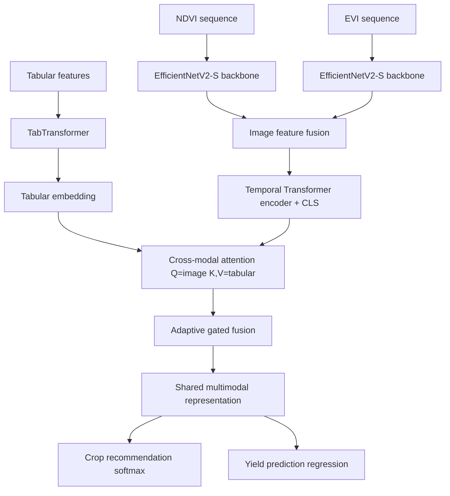

# CropFusion Model Architecture

The CropFusion model is a **multimodal neural architecture** that fuses
tabular agronomic features with satellite vegetation-index imagery. Full
implementation: `ai/models` (docs in `ai/models/docs/ARCHITECTURE.md`).

## Design

## Components

| Component | Detail |
|---|---|
| Tabular encoder | TabTransformer with learned categorical embeddings |
| Image encoders | Two `timm` EfficientNetV2-S backbones (classifier removed), one per vegetation index (NDVI, EVI) |
| Temporal encoder | Transformer over time steps with CLS-token pooling + temporal positional encoding |
| Fusion | Cross-modal attention (Q = image, K/V = tabular) followed by adaptive gated fusion (image gate, tabular gate, fusion gate) |
| Heads | Softmax crop-recommendation head + regression yield head |

## Modality routing

- **Multimodal (default):** full pipeline.
- **Tabular-only:** TabTransformer -> shared encoder -> heads.
- **Image-only:** image encoders -> temporal transformer -> shared encoder -> heads.

## Key design decisions

| Decision | Rationale |
|---|---|
| Pre-norm transformer blocks | Stable training at depth; standard practice |
| CLS-token pooling | Fixed-width embedding from variable-length sequences |
| Attention key-padding from `temporal_mask` | Padded / missing observations never contribute |
| Learnable per-sample gates | Model decides modality trust per location |
| `forward_export` tensor path | Clean TorchScript / ONNX tracing |

## Training targets

- **Classification metrics:** accuracy, precision, recall, F1 (macro/micro/
  weighted), ROC-AUC (one-vs-rest), top-K, per-class confusion.
- **Regression metrics:** MSE, RMSE, MAE, R², MAPE (zero-target guarded).
- **Combined multi-task score:** `0.5 * crop_acc + 0.5 * max(0, 1 - nRMSE)`.
- **System metrics:** inference latency (mean/p50/p95/p99), throughput
  (samples/s), parameter count, model size, memory footprint.

## Optimisation (ai/training + quality/optimization)

- ONNX Runtime export with quantization.
- TorchScript compilation with automatic fallback to eager mode when a
  compiler backend is unavailable (see `quality/optimization/runtime.py`).
- Batch-chunked inference for memory-constrained devices.
- Modes benchmarked: eager, torchscript, onnx fp32, onnx int8 (optional).
